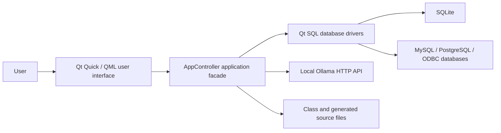
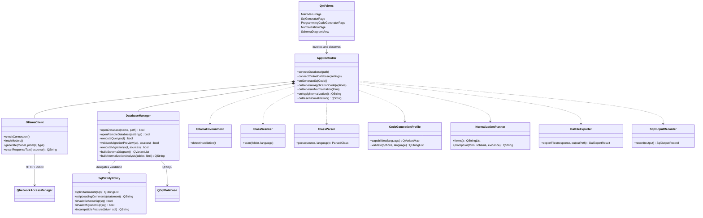
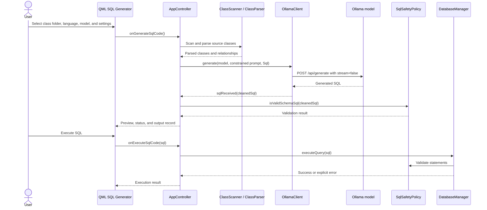
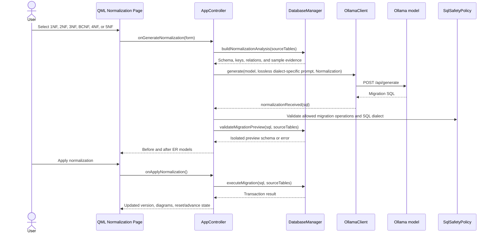

# ProteusManager Architecture

## Purpose and scope

ProteusManager is a Qt 6 desktop application that connects class models,
relational databases, and a locally operated Ollama model. The application can
derive SQL schemas from source classes, generate secure application layers,
inspect and normalize existing databases, and display schema relationships.

The current architecture follows a layered, MVVM-like approach. QML owns the
presentation, `AppController` exposes application use cases, and focused C++
components handle database access, AI communication, parsing, generation, and
file output.

## System context



## UML class diagram

The diagram shows the principal production classes and their dependency
direction. Utility value types are grouped under their owning services to keep
the view readable.



## Module responsibilities

| Layer | Modules | Responsibility |
| --- | --- | --- |
| Presentation | `main.qml`, `qml/*.qml` | Responsive workflows, settings, status, diagrams, and user input |
| Application | `AppController` | QML API, use-case coordination, state, and user-facing results |
| AI integration | `OllamaClient`, `OllamaEnvironment` | Endpoint checks, model discovery, prompt requests, and response routing |
| Database | `DatabaseManager` | Connections, schema inspection, previews, transactions, migrations, and ER data |
| SQL policy | `SqlSafetyPolicy` | SQL allowlists, statement parsing, and driver compatibility checks |
| Source analysis | `ClassScanner`, `ClassParser` | File discovery and language-specific class extraction |
| Generation | `CodeGenerationProfile`, `DalFileExporter` | Language capabilities, secure layer options, validation, and export |
| Normalization | `NormalizationPlanner` | 1NF through 5NF/BCNF selection and lossless prompt requirements |
| Traceability | `SqlOutputRecorder` | Reproducible records of generated SQL and the selected AI model |

## SQL generation sequence



## Normalization sequence

Normalization is a preview-and-apply workflow. Selecting a form does not alter
the source database. A migration is applied only after validation and explicit
confirmation.



## Security and data-integrity decisions

- AI output is treated as untrusted input and must pass deterministic policy
  checks before execution.
- Schema generation permits only explicitly supported DDL statements.
- Normalization migrations use a separate allowlist and reject destructive
  source-table changes.
- Driver-specific checks reject SQL functions that are incompatible with the
  selected SQLite, PostgreSQL, MySQL, or ODBC connection.
- Migration previews run against an isolated database state before the real
  transaction is offered to the user.
- Generated DAL and application code is required to use parameterized queries;
  SQL values are not assembled through string concatenation.
- Normalization keeps version metadata so users can move forward or reset while
  preserving the original source data.

## Clean-code changes

### Completed in this revision

- Extracted SQL validation and dialect rules from `DatabaseManager` into the
  stateless `SqlSafetyPolicy` component.
- Kept the existing `DatabaseManager` methods as compatibility wrappers, so the
  QML-facing contract and existing callers remain stable.
- Removed duplicate statement/comment parsing paths from database operations.
- Added focused tests for schema policy, migration policy, SQL dialect checks,
  statement splitting, and comment cleanup.
- Registered the policy source in the application and relevant CTest targets.

### Remaining architecture debt

`AppController` and `DatabaseManager` are still broad classes. Their current
interfaces are retained to avoid a risky all-at-once rewrite. The next safe
increments should extract these services behind the same public facade:

1. `NormalizationService` for normalization history, preview, apply, and reset.
2. `SchemaIntrospector` for tables, columns, relationships, and ER view models.
3. `MigrationExecutor` for isolated previews and transactional execution.
4. `CodeGenerationService` for prompts, repair attempts, and output validation.
5. `SettingsRepository` for endpoint, paths, language, and generation profiles.

The legacy Qt Widgets classes under `windows/` are still compiled even though
the application starts through QML. They should be removed only after confirming
that no supported workflow still depends on them.

## Verification

The CMake build and all ten CTest targets must pass after architecture changes:

```text
ClassParserTest
ClassScannerTest
DatabaseManagerTest
NormalizationPlannerTest
SqlValidationTest
DalGenerationTest
SqlOutputRecorderTest
OllamaClientTest
OllamaEnvironmentTest
QmlWorkflowTest
```
