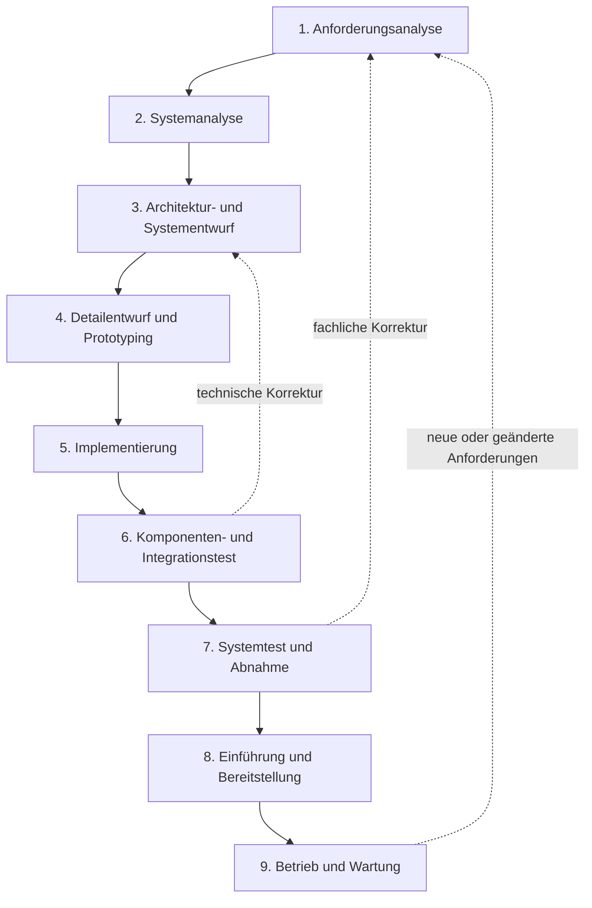

# Erweitertes Wasserfallmodell für ProteusManager

## Vorgehensmodell

ProteusManager wird nach einem erweiterten Wasserfallmodell entwickelt. Die
Phasen besitzen definierte Ergebnisse, werden aber durch Prüf- und
Rückkopplungsschritte verbunden. Ein Fehler aus Test oder Abnahme führt damit
gezielt in die betroffene frühere Phase zurück, statt nur am Ende korrigiert zu
werden.

## 1. Anforderungsanalyse

Es wurden die fachlichen Ziele und Anwenderabläufe gesammelt und über GitHub
Issues nachvollziehbar gemacht.

- Klassen aus C++, C#, Java, Python und weiteren Sprachen sollen nur dann in
  SQL überführt werden, wenn tatsächlich Klassenmodelle erkannt wurden.
- Lokale SQLite-Dateien und entfernte Datenbanken sollen über eine gemeinsame
  Oberfläche erreichbar sein.
- Ollama soll lokal erkannt, geprüft und erst mit mindestens einem verfügbaren
  Modell für AI-Funktionen freigeschaltet werden.
- SQL-, DAL- und Anwendungscode sollen passend zur gewählten Sprache und zum
  gewählten Datenbanksystem erzeugt werden.
- Datenbanken sollen verlustfrei zwischen 1NF bis 5NF und BCNF normalisiert,
  vorab visualisiert, angewendet und zurückgesetzt werden können.
- Generierter Code und SQL sollen gegen Injection, ungeeignete Befehle und
  inkompatible SQL-Dialekte geschützt werden.
- Die wichtigsten Workflows sollen automatisiert und reproduzierbar getestet
  werden.

**Ergebnis:** Funktionsumfang, Sicherheitsziele, Akzeptanzkriterien und
issue-basierte Arbeitspakete wurden festgelegt.

## 2. Systemanalyse

Der vorhandene Qt/C++-Stand, die QML-Umstellung und die externen Abhängigkeiten
wurden untersucht.

- Die Oberfläche verwendet Qt Quick/QML; C++ stellt Zustände und Aktionen über
  `AppController` bereit.
- SQLite ist der primäre lokale Pfad. QMYSQL, QPSQL und QODBC bilden die
  konfigurierbaren Online-Verbindungen ab.
- Ollama kommuniziert lokal über HTTP und JSON mit `/api/tags` und
  `/api/generate`.
- Risiken wurden in AI-generiertem SQL, Datenverlust bei Migrationen,
  Dialektunterschieden, dynamischem Code und überladenen Controller-Klassen
  erkannt.
- Die wichtigste Qualitätslücke war die Vermischung von Datenbankzugriff,
  SQL-Sicherheitsregeln, Schemaanalyse und Normalisierung in großen Klassen.

**Ergebnis:** Ist-Architektur, Schnittstellen, Datenflüsse, Risiken und
Refaktorierungsgrenzen wurden dokumentiert.

## 3. Architektur- und Systementwurf

Die Anwendung wurde in Präsentations-, Anwendungs-, Integrations-, Datenbank-
und Hilfsschichten gegliedert.

- QML ist ausschließlich für Darstellung und Interaktion zuständig.
- `AppController` dient als QML-kompatible Anwendungsfassade.
- `OllamaClient` kapselt HTTP, JSON, Modellabfrage und Antwortsignale.
- `DatabaseManager` kapselt Qt-SQL-Verbindungen, Schemaanalyse, Preview und
  Transaktionen.
- `SqlSafetyPolicy` kapselt deterministische SQL-Regeln unabhängig von UI,
  Datenbankverbindung und AI.
- Parser, Scanner, Normalisierungsplanung, Codeprofile und Export wurden als
  eigenständige Komponenten eingeordnet.
- Preview vor Apply und versionierte Normalisierungsstände wurden als zentrale
  Schutzmechanismen entworfen.

**Ergebnis:** UML-Klassenbild, Abhängigkeitsrichtung, Modulverantwortung und
Sequenzen sind in [ARCHITECTURE.md](ARCHITECTURE.md) festgehalten.

## 4. Detailentwurf und Prototyping

Die fachlichen Workflows wurden in konkrete Oberflächenzustände und
Komponentenverträge übersetzt.

- QML-Seiten wurden für Hauptmenü, SQL-Erzeugung, Code-Erzeugung und
  Normalisierung aufgeteilt.
- Datenbankmodus, Treiber, Adresse, Port, Zugangsdaten und Status wurden als
  klarer Verbindungsablauf modelliert.
- Sprachabhängige Codeoptionen und kurze kontextbezogene Hilfen wurden
  vorgesehen.
- Vorher-/Nachher-Schemata wurden als ER-View-Modelle mit Tabellen,
  Primärschlüsseln und Fremdschlüsselbeziehungen definiert.
- Normalisierungsformen wurden als auswählbare Vorschau modelliert; erst
  `Apply normalization` darf die verbundene Datenbank verändern.
- AI-Prompts erhielten Regeln zu Sprache, SQL-Dialekt, Datenübernahme,
  Fremdschlüsseln und ausführbarem Ausgabeformat.

**Ergebnis:** Bedienabläufe, QML-Komponenten, Promptverträge und
Validierungsregeln lagen vor der endgültigen Implementierung fest.

## 5. Implementierung

Die entworfenen Funktionen wurden schrittweise und issue-bezogen umgesetzt.

- QML-Anwendung mit responsivem Layout, Statusmeldungen und Einstellungsdialogen.
- Lokale und entfernte Datenbankverbindungen über Qt SQL.
- Klassen-Scanning und Parsing für die SQL-Erzeugung.
- Ollama-Erkennung, Modellliste, konfigurierbarer Endpoint und Anfrageverarbeitung.
- SQL-, DAL- und mehrschichtige Code-Erzeugung mit sprachabhängigen Profilen.
- Normalisierungsanalyse, AI-Migration, isolierte Vorschau, Apply, Reset,
  Vorwärtsnavigation und Vorher-/Nachher-ER-Diagramme.
- SQL-Ausgabeprotokoll für Modell, Anfrageart und Ergebnis.
- Clean-Code-Refaktorierung der SQL-Regeln in `SqlSafetyPolicy`, ohne den
  bestehenden öffentlichen `DatabaseManager`-Vertrag zu brechen.

**Ergebnis:** Ein CMake-buildbares Qt-6-System mit getrennten QML- und
C++-Verantwortungen sowie abgesicherter AI-Integration.

## 6. Komponenten- und Integrationstest

Für die wichtigsten Komponenten wurden Qt-Test-Programme in CMake/CTest
integriert.

- Parser- und Scanner-Tests prüfen Quellklassen und Attributerkennung.
- `DatabaseManagerTest` prüft Verbindungen, Schemaoperationen,
  Normalisierungsnachweise und verlustfreie Migrationen mit SQLite.
- `SqlValidationTest` prüft DDL- und Migrations-Policies,
  Statement-Aufteilung, Kommentare und SQL-Dialektgrenzen.
- DAL- und Output-Tests prüfen Dateinamen, Strukturen und reproduzierbare
  SQL-Protokolle.
- Ollama-Tests prüfen Kommunikation und Umgebung mit kontrollierten Antworten,
  ohne ein echtes Modell für jeden Test vorauszusetzen.
- `QmlWorkflowTest` lädt die QML-Oberfläche mit einem Test-Controller und prüft
  zentrale Bedienabläufe.

**Ergebnis:** Nach der Clean-Code-Änderung bauen Anwendung und Tests; alle zehn
CTest-Ziele laufen erfolgreich durch.

## 7. Systemtest und Abnahme

Die Komponenten wurden in realistischen Benutzerabläufen gemeinsam geprüft.

- SQL-Erzeugung wurde vom Klassenordner bis zur Vorschau und Ausführung geprüft.
- Normalisierung wurde mit unnormalisierten Bestelltabellen und flachen
  Beispieldatenbanken als Regression getestet.
- Vorher- und Nachherdiagramm, Dialektprüfung sowie Apply-/Reset-Zustände wurden
  in den Workflow einbezogen.
- Fehler wie eine geleerte SQLite-Datenbank oder `NO_CHANGES_REQUIRED` trotz
  Normalisierungsnachweis führten zurück in Analyse, Promptdesign und Tests.
- Unterschiedliche Ollama-Modelle bleiben ein Abnahmerisiko: Deterministische
  Prüfungen können Sicherheit und Struktur validieren, aber keine identische
  AI-Ausgabe für jedes Modell garantieren.

**Ergebnis:** Die automatisierten Systempfade sind grün. Manuelle Abnahmetests
auf sauberen Systemen sowie mit allen unterstützten Remote-Treibern bleiben als
separate Freigabeschritte erforderlich.

## 8. Einführung und Bereitstellung

Die lokale Einrichtung und der Build wurden für Entwickler und Anwender
dokumentiert.

- CMake und Qt Creator bilden den reproduzierbaren Build- und Testweg.
- Ollama-Installation, Modellinstallation, Endpoint und Fehlerdiagnose sind in
  `docs/AI_SETUP.md` dokumentiert.
- Fachliche Bedienung und Einstellungen sind in den thematischen Dokumenten
  unter `docs/` beschrieben.
- Git verwendet `main` als stabilen Stand, `dev` als Integrationszweig und
  issue-bezogene Branches für nachvollziehbare Arbeitspakete.

**Ergebnis:** Entwicklungs- und AI-Umgebung sind dokumentiert; ein vollständig
signiertes Installationspaket und ein automatisierter Releaseprozess sind noch
nicht Bestandteil des aktuellen Stands.

## 9. Betrieb und Wartung

Fehlerbehebung und Erweiterungen werden über Issues, Tests und kleine logische
Commits zurück in den Entwicklungsprozess geführt.

- Neue Fehler erhalten zuerst einen reproduzierbaren Testfall.
- Sicherheitsregeln bleiben deterministisch und werden nicht ausschließlich dem
  Sprachmodell überlassen.
- Architekturänderungen müssen CMake-Build und alle CTest-Ziele bestehen.
- Die nächsten Refaktorierungen teilen Normalisierung, Schemaanalyse,
  Migration und Code-Erzeugung weiter aus den großen Fassaden heraus.
- Remote-Datenbank-Preview, Packaging und Tests auf einem sauberen System werden
  als offene Qualitäts- und Einführungsaufgaben geführt.

**Ergebnis:** Wartungsregeln, technische Schulden und Rückkopplungswege sind
explizit dokumentiert.

## Phasenergebnisse und Nachweise

| Phase | Nachweis im Projekt |
| --- | --- |
| Anforderungen | GitHub Issues und Akzeptanzkriterien |
| Analyse | Projekt- und Risikobeschreibung in dieser Dokumentation |
| Architektur | `docs/ARCHITECTURE.md` mit UML und Sequenzen |
| Detailentwurf | QML-Seiten, Profile, Prompt- und Preview-Verträge |
| Implementierung | C++-, QML- und CMake-Quellstand |
| Test | `tests/`, CTest-Registrierung und reproduzierbarer grüner Lauf |
| Abnahme | Workflow-Regressionsfälle und dokumentierte Restrisiken |
| Einführung | README sowie AI-, Code- und Normalisierungsanleitungen |
| Wartung | Issue-Branches, logische Commits und Refactoring-Roadmap |
