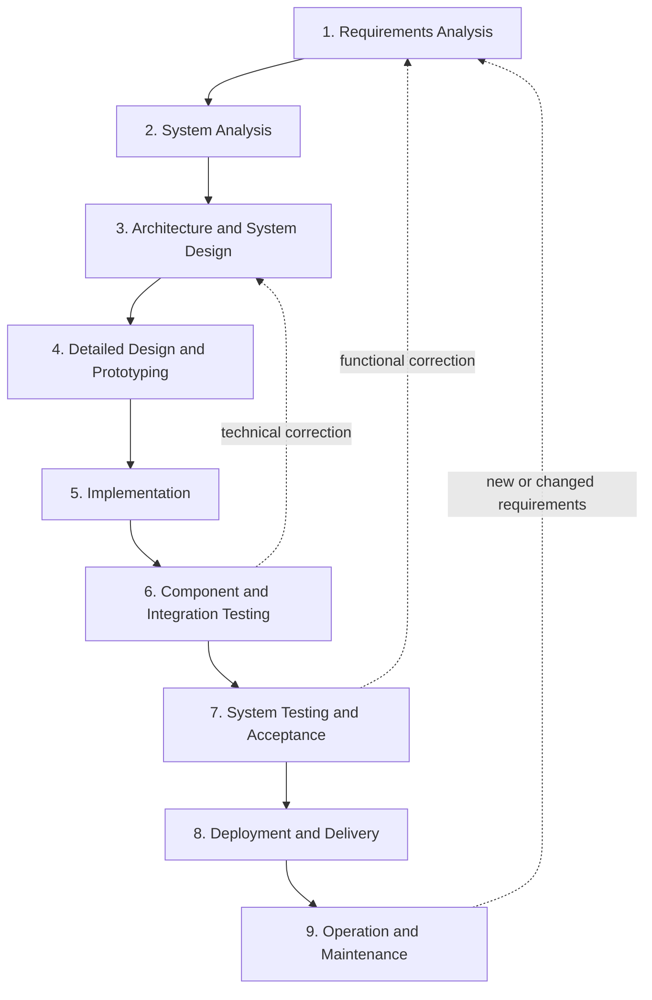

# Extended Waterfall Model for ProteusManager

## Process Model

ProteusManager is developed according to an extended waterfall model. Each
phase has defined deliverables, while review and feedback steps connect the
phases. A defect found during testing or acceptance therefore leads back to the
affected earlier phase instead of being corrected only at the end.

## 1. Requirements Analysis

The functional goals and user workflows were collected and made traceable
through GitHub issues.

- Classes from C++, C#, Java, Python, and other languages should be converted
  to SQL only when actual class models have been detected.
- Local SQLite files and remote databases should be accessible through one
  consistent interface.
- Ollama should be detected and validated locally, and AI features should be
  enabled only when at least one model is available.
- SQL, DAL, and application code should be generated for the selected
  programming language and database system.
- Databases should be normalized without data loss between 1NF, 2NF, 3NF,
  BCNF, 4NF, and 5NF, including preview, application, and reset workflows.
- Generated code and SQL should be protected against injection, unsuitable
  statements, and incompatible SQL dialects.
- The most important workflows should be tested automatically and
  reproducibly.

**Result:** The functional scope, security goals, acceptance criteria, and
issue-based work packages were defined.

## 2. System Analysis

The existing Qt/C++ implementation, the QML migration, and the external
dependencies were analyzed.

- The user interface uses Qt Quick/QML; C++ exposes state and actions through
  `AppController`.
- SQLite is the primary local database path. QMYSQL, QPSQL, and QODBC provide
  the configurable remote database connections.
- Ollama communicates locally over HTTP and JSON through `/api/tags` and
  `/api/generate`.
- Risks were identified in AI-generated SQL, data loss during migrations, SQL
  dialect differences, dynamic code, and overloaded controller classes.
- The main quality concern was the combination of database access, SQL safety
  rules, schema analysis, and normalization in large classes.

**Result:** The current architecture, interfaces, data flows, risks, and
refactoring boundaries were documented.

## 3. Architecture and System Design

The application was divided into presentation, application, integration,
database, and utility layers.

- QML is responsible exclusively for presentation and interaction.
- `AppController` serves as the QML-compatible application facade.
- `OllamaClient` encapsulates HTTP, JSON, model discovery, and response
  signals.
- `DatabaseManager` encapsulates Qt SQL connections, schema analysis,
  previews, and transactions.
- `SqlSafetyPolicy` encapsulates deterministic SQL rules independently of the
  UI, database connection, and AI integration.
- Parsers, scanners, normalization planning, code profiles, and export logic
  were classified as independent components.
- Preview before apply and versioned normalization states were designed as
  central protection mechanisms.

**Result:** The UML class diagram, dependency direction, module
responsibilities, and sequences are documented in
[ARCHITECTURE.md](ARCHITECTURE.md).

## 4. Detailed Design and Prototyping

The functional workflows were translated into concrete interface states and
component contracts.

- Separate QML pages were designed for the main menu, SQL generation, code
  generation, and normalization.
- Database mode, driver, address, port, credentials, and status were modeled
  as a clear connection workflow.
- Language-specific code options and concise contextual help were planned.
- Before and after schemas were defined as ER view models containing tables,
  primary keys, and foreign-key relationships.
- Normal forms were modeled as selectable previews; only
  `Apply normalization` may modify the connected database.
- AI prompts received rules for language, SQL dialect, data migration,
  foreign keys, and executable output format.

**Result:** User workflows, QML components, prompt contracts, and validation
rules were defined before the final implementation.

## 5. Implementation

The designed features were implemented incrementally and tracked through
issues.

- QML application with responsive layouts, status messages, and settings
  dialogs.
- Local and remote database connections through Qt SQL.
- Class scanning and parsing for SQL generation.
- Ollama detection, model listing, configurable endpoint, and request
  processing.
- SQL, DAL, and multi-layer code generation with language-specific profiles.
- Normalization analysis, AI migration, isolated preview, apply, reset,
  forward and backward navigation, and before/after ER diagrams.
- SQL output records containing the model, request type, and result.
- Clean-code extraction of SQL rules into `SqlSafetyPolicy` without breaking
  the existing public `DatabaseManager` contract.

**Result:** A CMake-buildable Qt 6 application with separated QML and C++
responsibilities and a safeguarded AI integration.

## 6. Component and Integration Testing

Qt Test executables for the main components were integrated with CMake and
CTest.

- Parser and scanner tests verify source classes and attribute detection.
- `DatabaseManagerTest` verifies connections, schema operations,
  normalization evidence, and lossless SQLite migrations.
- `SqlValidationTest` verifies DDL and migration policies, statement
  splitting, comments, and SQL dialect boundaries.
- DAL and output tests verify file names, structures, and reproducible SQL
  records.
- Ollama tests verify communication and environment handling with controlled
  responses without requiring a real model for every test.
- `QmlWorkflowTest` loads the QML interface with a test controller and verifies
  central user workflows.

**Result:** The application and tests build after the clean-code change, and
all ten CTest targets pass.

## 7. System Testing and Acceptance

The components were tested together in realistic user workflows.

- SQL generation was tested from class-folder selection through preview and
  execution.
- Normalization was regression-tested with unnormalized order tables and flat
  sample databases.
- Before and after diagrams, dialect validation, and apply/reset states were
  included in the workflow tests.
- Defects such as an emptied SQLite database or `NO_CHANGES_REQUIRED` despite
  normalization evidence led back to analysis, prompt design, and testing.
- Different Ollama models remain an acceptance risk: deterministic checks can
  validate safety and structure, but they cannot guarantee identical AI output
  from every model.

**Result:** The automated system paths pass. Manual acceptance tests on clean
systems and with every supported remote driver remain separate release steps.

## 8. Deployment and Delivery

The local setup and build process were documented for developers and users.

- CMake and Qt Creator provide the reproducible build and test workflow.
- Ollama installation, model installation, endpoint configuration, and
  troubleshooting are documented in `docs/AI_SETUP.md`.
- Functional workflows and settings are described in the topic-specific
  documents under `docs/`.
- Git uses `main` for the stable state, `dev` as the integration branch, and
  issue branches for traceable work packages.

**Result:** The development and AI environments are documented. A fully
signed installer and an automated release process are not yet part of the
current project state.

## 9. Operation and Maintenance

Defect fixes and enhancements are fed back into the development process
through issues, tests, and small logical commits.

- New defects receive a reproducible test case first.
- Security rules remain deterministic and are not delegated exclusively to
  the language model.
- Architecture changes must pass the CMake build and all CTest targets.
- Planned refactoring will further separate normalization, schema analysis,
  migration, and code generation from the large facades.
- Remote database previews, packaging, and clean-system tests are tracked as
  open quality and deployment tasks.

**Result:** Maintenance rules, technical debt, and feedback paths are
explicitly documented.

## Phase Results and Evidence

| Phase | Project evidence |
| --- | --- |
| Requirements | GitHub issues and acceptance criteria |
| Analysis | Project and risk description in this document |
| Architecture | `docs/ARCHITECTURE.md` with UML and sequence diagrams |
| Detailed design | QML pages, profiles, prompt contracts, and preview contracts |
| Implementation | C++, QML, and CMake source code |
| Testing | `tests/`, CTest registration, and a reproducible passing run |
| Acceptance | Workflow regression cases and documented residual risks |
| Deployment | README and AI, code, and normalization guides |
| Maintenance | Issue branches, logical commits, and the refactoring roadmap |
